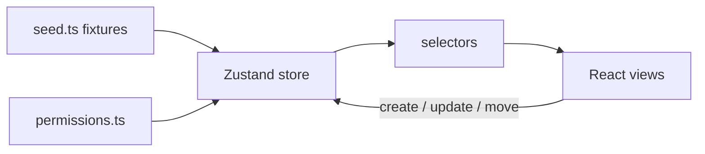

# Flowboard

A small project board for one team. You get a sidebar tree (workspace, space, folder, list), a kanban board, a list view, and a task drawer. There is no server. Data lives in a Zustand store, loaded from seed fixtures, and saved to `localStorage`.

Try the user switcher in the top right, labeled **Acting as**.

## Run it

```bash
npm install
npm run dev
```

Vite prints a local URL, usually `http://localhost:5173`.

```bash
npm test
npm run build
```

**Reset seed** in the top bar puts the fixtures back if you have been clicking around. The saved store is under the `localStorage` key `flowboard-store`.

## How it is put together



`src/seed.ts` fills the store on first load. React never talks to a database. Components read selectors and call store functions.

The store keeps containers, tasks, statuses, users, and grants in maps keyed by id. The board and the list are two ways of showing the same tasks. A card’s column is `statusId`. Order inside that column is `position`.

I used Zustand because this app is one store and a handful of actions. Permission checks sit next to those actions, in `src/lib/permissions.ts`. A failed write returns `{ error: { code, message } }` and the UI shows a toast. If Bob calls `updateTask` on a Marketing task, the title does not change.

Styling is Tailwind classes in the JSX. Colors, radius, and shadow are tokens in `src/index.css` under `@theme`.

## Data model

```
Workspace (Acme)
└── Space
    └── Folder
        └── List
              └── Tasks
              └── Statuses for that list only (todo / in progress / done)
```

A task belongs to one list (`primaryListId`) and one status from that list. Title is required and capped at 500 characters. Priority is urgent, high, normal, low, or none.

Deleting is a soft delete. `archivedAt` is set on the container or task, and on every child container under it. Archived rows stay in the maps and disappear from the tree and the board.

A grant is `{ resourceId, userId, mode: allow | deny }` on a space, folder, or list.

The seed is one workspace (Acme), two spaces (Engineering, Marketing), two folders (Q2 Launch, Campaigns), three lists (Backlog, Sprint, Social), 17 tasks, and three users.

## Permissions

| User | Role | What they see |
|---|---|---|
| Alice | admin | The whole tree. She can edit tasks and change the tree. |
| Bob | member | Engineering, including public Backlog and private Sprint (he has an allow on Sprint). Marketing is hidden. |
| Carol | member | Public Engineering lists. Sprint is hidden. Marketing is visible because she has an allow on that space. |

The check walks from the node up to the workspace:

1. Alice skips grants.
2. A `deny` on the node or any parent hides it.
3. A private node stays hidden unless this user has an `allow` on it.
4. A public node is visible unless it is denied.
5. If a parent is hidden, its children are hidden too.
6. A member can edit tasks only on lists they can see.
7. Only an admin can create, rename, or archive containers.

Those rules run in `canViewContainer` and in every mutation. The sidebar is built from `visibleTree`, which uses the same check, so switching users updates the tree immediately.


## Drag and drop

Dragging a card to another column changes its status. Dragging it within a column changes its order. `@dnd-kit` needs an inline `style` for `transform` and `transition` on the card being dragged, in `src/components/KanbanBoard.tsx`. That is the only inline style in the app. Sidebar indent uses Tailwind padding classes.

## What I shipped, and what I left

Shipped: admin tree create / rename / archive, kanban and list, task drawer, drag between columns and inside a column, user switcher, skeletons, empty states, toasts, permission tests, and `localStorage` plus Reset seed.

Left for later: subtasks, search, bulk edit, an activity feed, optimistic drag with rollback, Storybook, and a mobile layout. `parentTaskId` is on the task type and stays `null`. Sidebar items are ordered by `position` when they are created.

## AI

I used Cursor while building this. It helped with the Tailwind v4 Vite plugin, the Zustand `persist` setup, the `@dnd-kit` column wiring, and the Vitest setup. The data model, the permission rules, and what to cut were decided before the UI. More detail is in [AI_USAGE.md](./AI_USAGE.md).
